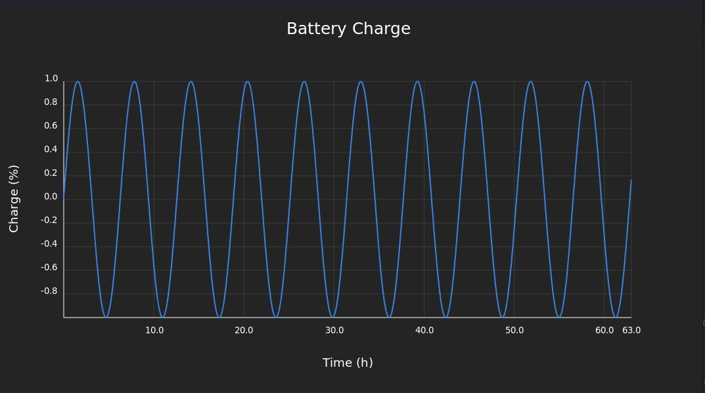

# GTK Plot Widget in Rust

This is a simple GTK widget for plotting data. It is a quick prototype and my first GTK development.
I saw the [battery stats application](https://flathub.org/apps/org.gnome.PowerStats) was not ported to GTK4 and I started to look into plotting widgets in GTK4 and Rust.
Out of curiosity and because I did not find any I learned to write my own.

I took inspiration and copy some code from :
- [GNOME Power Statistics](https://gitlab.gnome.org/GNOME/gnome-power-manager/-/tree/master)
- [Live chart](https://github.com/lcallarec/live-chart)
- [GTK Chart](https://github.com/lundmar/gtkchart)

To try it out install the dependencies and run the example:
```bash
# Install dependencies (gtk4 and libadwaita)
sudo apt install libgtk-4-dev libadwaita-1-dev

cargo run --release
```

Screenshot:


